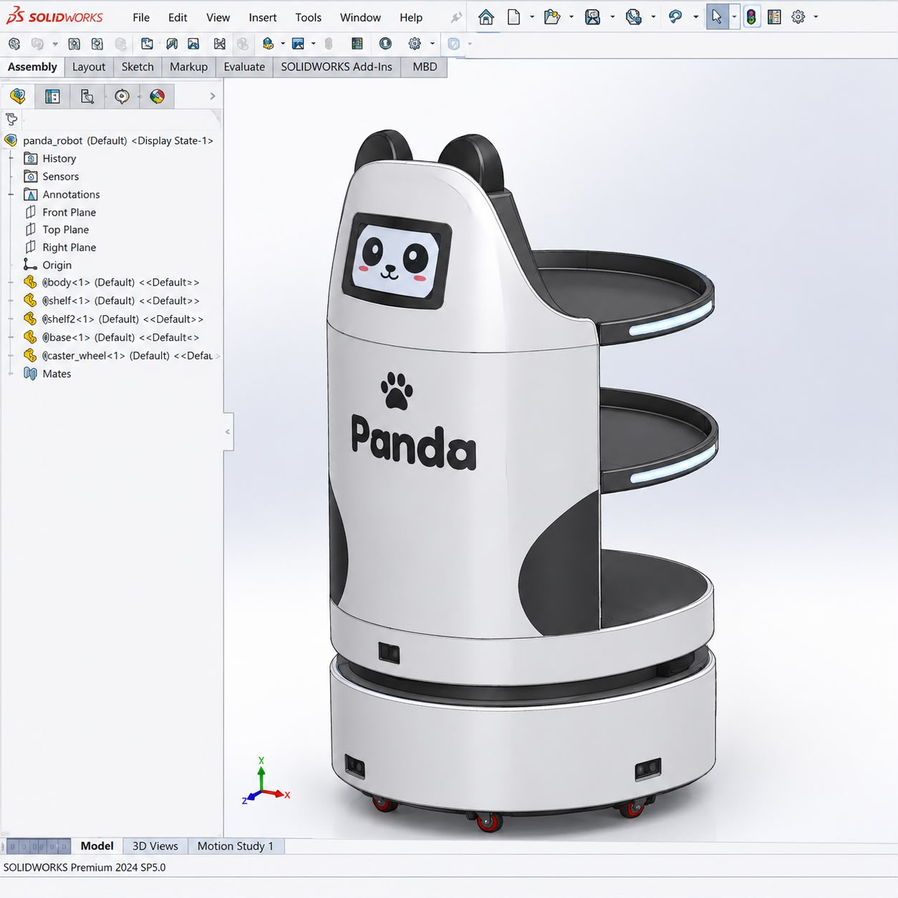
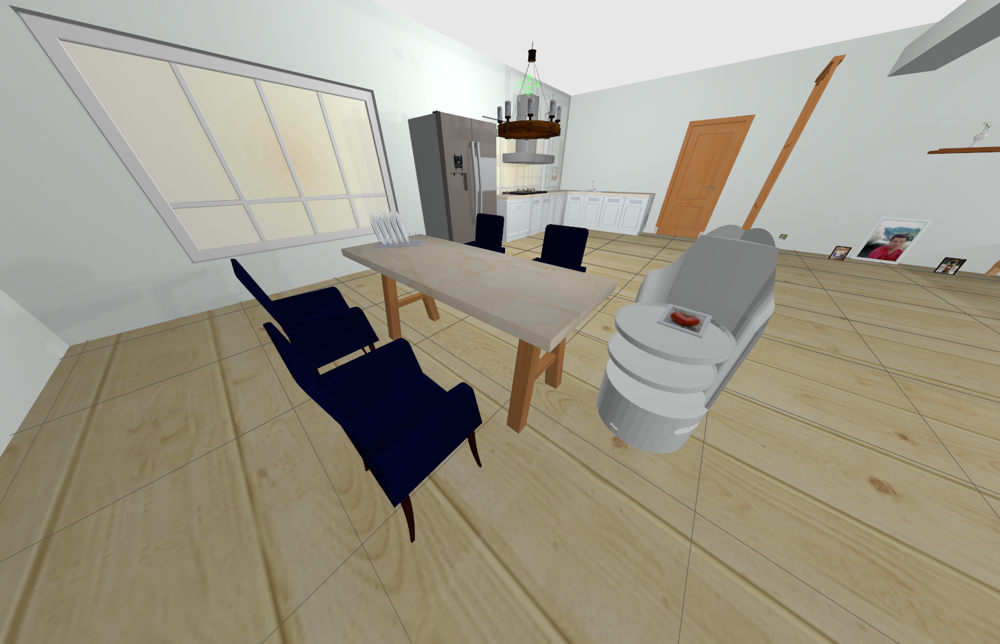
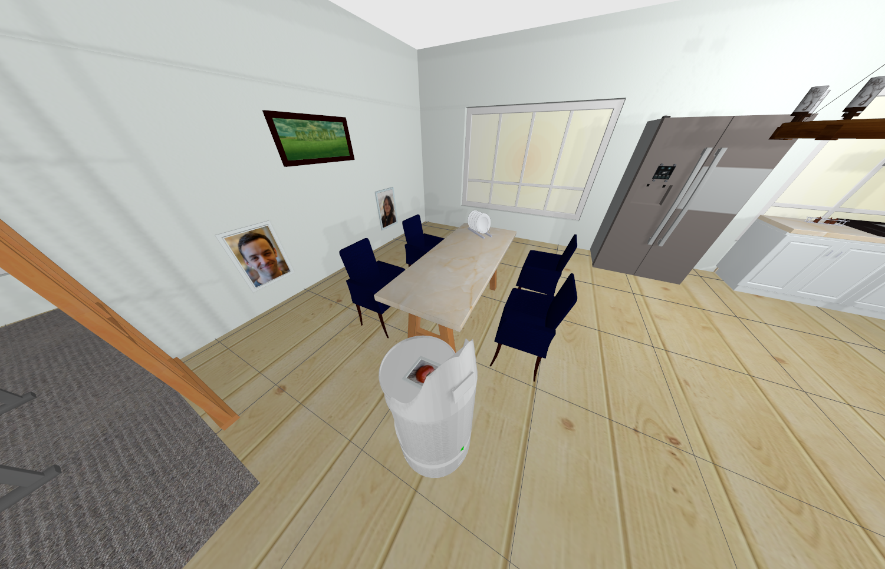
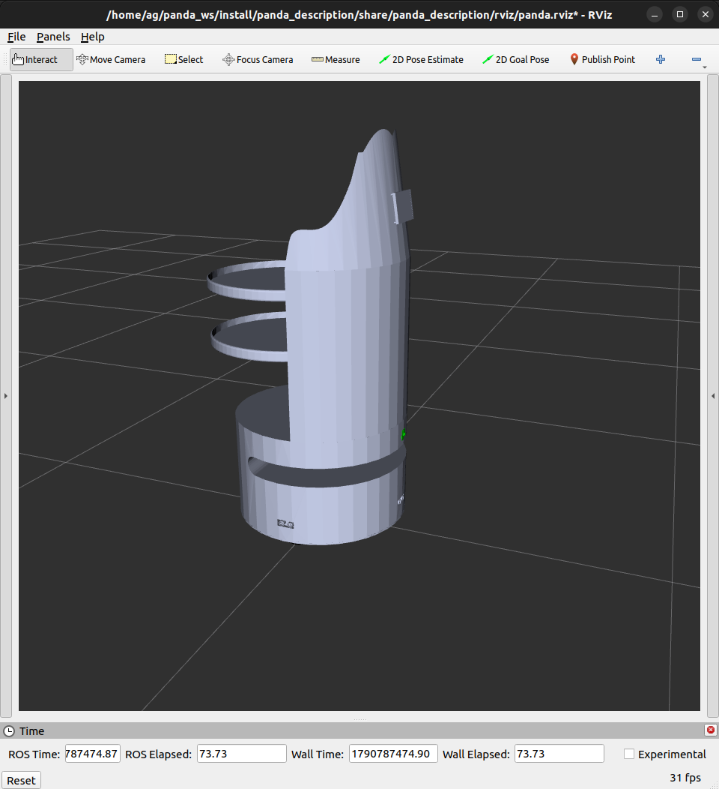

# 🐼 Panda-Bot

**Panda-Bot** is a ROS 2-powered autonomous restaurant delivery robot designed for indoor mobile robotics applications.

The project combines **CAD-based robot modeling, differential-drive control, ros2_control, odometry, sensor simulation, probabilistic motion modeling, state estimation, and localization** into a modular robotics platform.

<p align="center">
  
  
</p>

---

## 🚀 Overview

Panda-Bot is an indoor differential-drive mobile robot designed as a platform for autonomous restaurant delivery.

### Current capabilities

* 🤖 ROS 2 robot architecture
* 🧩 URDF/Xacro robot description
* ⚙️ ros2_control integration
* 🚗 Differential-drive control
* 📐 Forward & inverse DDR kinematics
* 🧭 Wheel-based odometry
* 🔄 TF2 frame broadcasting
* 🎮 Joystick teleoperation
* 📡 LiDAR simulation
* 📷 RGB camera simulation
* 🧭 IMU simulation
* 🌍 Gazebo physics simulation
* 👁️ RViz2 visualization
* 🌉 ROS 2 ↔ Gazebo communication
* 📊 Noisy odometry simulation
* 📈 Kalman filtering
* 🧮 Extended Kalman Filter using `robot_localization`
* 🎲 Probabilistic Odometry Motion Model
* 📍 Localization foundation

The platform is being developed toward **SLAM, probabilistic localization, autonomous navigation, perception, and restaurant delivery**.

---

## 🧠 System Architecture

```text
                         ┌──────────────────────┐
                         │      Panda-Bot       │
                         │   Mobile Platform    │
                         └──────────┬───────────┘
                                    │
             ┌──────────────────────┼──────────────────────┐
             │                      │                      │
       Robot Description       Control System          Sensors
             │                      │                      │
      ┌──────┴──────┐       ┌──────┴──────┐       ┌──────┴──────┐
      │ URDF/Xacro  │       │ ros2_control │       │   LiDAR     │
      │ CAD Meshes  │       │ DDR Control  │       │   Camera    │
      │ TF Frames   │       │ Odometry     │       │   IMU       │
      └─────────────┘       └──────┬──────┘       └──────┬──────┘
                                   │                      │
                                   ▼                      │
                            Noisy Odometry                │
                                   │                      │
                    ┌──────────────┴──────────────┐       │
                    │                             │       │
                    ▼                             ▼       │
             Kalman Filter              Odometry Motion   │
                    │                         Model       │
                    ▼                             │       │
              State Estimate                    ▼       │
                    │                       Particles     │
                    │                             │       │
                    └──────────────┬──────────────┘       │
                                   ▼                      ▼
                              Localization           Sensor Fusion
```

---

## 📐 Differential-Drive Kinematics

Panda-Bot uses a differential-drive configuration with:

```text
Wheel Radius       = 0.065 m
Wheel Separation   = 0.37 m
```

### Forward Kinematics

```text
v     = r/2 · (φR + φL)

ω     = r/L · (φR - φL)
```

Where:

* `r` = wheel radius
* `L` = wheel separation
* `φR` = right wheel angular velocity
* `φL` = left wheel angular velocity
* `v` = linear velocity
* `ω` = angular velocity

### Inverse Kinematics

```text
φR = v/r + Lω/(2r)

φL = v/r - Lω/(2r)
```

The complete mathematical derivation is available in:

```text
media/DDR_kinematics.pdf
```

---

## ⚙️ ros2_control

The robot uses `ros2_control` to separate the control layer from the robot hardware and simulation interface.

```text
                     ROS 2
                       │
                       ▼
              ┌─────────────────┐
              │ Controller      │
              │ Manager         │
              └────────┬────────┘
                       │
             ┌─────────┴─────────┐
             │                   │
             ▼                   ▼
      DiffDriveController   JointGroupVelocity
             │                   │
             └─────────┬─────────┘
                       ▼
                  Wheel Joints
                       │
                       ▼
               Gazebo / Hardware
```

---

## 🎛️ Differential-Drive Controllers

Two control approaches are available.

### Standard Controller

Uses:

```text
diff_drive_controller/DiffDriveController
```

Provides:

* `cmd_vel` processing
* Differential-drive kinematics
* Wheel velocity commands
* Odometry
* Odometry TF
* Velocity limiting

### Custom Controller

A Python implementation is provided to expose the internal DDR mathematics:

```text
TwistStamped
     │
     ▼
Inverse Kinematics
     │
     ▼
Wheel Velocities
     │
     ▼
JointGroupVelocityController
     │
     ▼
Wheel Joints
     │
     ▼
Joint States
     │
     ▼
Forward Kinematics
     │
     ▼
Odometry + TF
```

Launch:

```bash
ros2 launch panda_controller controller.launch.py
```

Custom controller:

```bash
ros2 launch panda_controller controller.launch.py \
  use_simple_controller:=true
```

Standard controller:

```bash
ros2 launch panda_controller controller.launch.py \
  use_simple_controller:=false
```

> The two controllers are alternative control paths and should not command the same wheel joints simultaneously.

---

## 🧭 Odometry

Wheel encoder measurements are converted into robot motion using differential-drive forward kinematics.

```text
Wheel Positions
      │
      ▼
ΔθR , ΔθL
      │
      ▼
Forward Kinematics
      │
      ├──────────────► Linear Velocity
      │
      ├──────────────► Angular Velocity
      │
      ▼
Δs , Δθ
      │
      ▼
x , y , θ
      │
      ├──────────────► /panda_controller/odom
      │
      └──────────────► odom → base_footprint
```

The project also includes a **noisy odometry controller** that introduces encoder uncertainty to simulate realistic sensor behavior.

```text
Joint States
     │
     ▼
Encoder Noise
     │
     ▼
Noisy Wheel Measurements
     │
     ▼
Differential-Drive Odometry
     │
     ▼
/panda_controller/odom_noisy
```

---

## 📊 State Estimation

### Kalman Filter

A simple Kalman Filter implementation is included for studying probabilistic state estimation.

It demonstrates the two fundamental stages:

```text
Prediction
    │
    ▼
Measurement Update
    │
    ▼
Filtered Estimate
```

The filter combines motion information with IMU measurements to reduce uncertainty.

---

## 🧮 Extended Kalman Filter

The project also uses the ROS 2 `robot_localization` package for practical sensor fusion.

Current configuration operates in planar mode:

```text
two_d_mode: true
```

The EKF combines:

```text
Noisy Wheel Odometry
        │
        ├──────────────┐
        │              │
        ▼              ▼
   Prediction       IMU Data
        │              │
        └──────┬───────┘
               ▼
        Extended Kalman
             Filter
               │
               ▼
        Estimated State
```

Launch the localization pipeline with:

```bash
ros2 launch panda_localization local_localization.launch.py
```

Main configuration:

```text
panda_localization/
├── config/
│   └── ekf.yaml
├── launch/
│   └── local_localization.launch.py
└── panda_localization/
    ├── imu_republisher.py
    ├── kalman_filter.py
    └── odometry_motion_model.py
```

---

## 🎲 Odometry Motion Model

Panda-Bot also implements a probabilistic odometry motion model used as the **prediction component of a particle-filter-based localization system**.

The model decomposes robot motion into:

```text
Δrot1  →  Δtrans  →  Δrot2
```

where:

* `Δrot1` = initial rotation
* `Δtrans` = translation
* `Δrot2` = final rotation

The motion is modeled probabilistically because odometry is affected by:

* Encoder noise
* Wheel slip
* Wheel radius uncertainty
* Wheel separation uncertainty
* Mechanical errors
* Accumulated motion error

The model uses noise parameters:

```text
α1
α2
α3
α4
```

and generates multiple possible robot poses.

```text
                 Odometry
                    │
                    ▼
            Motion Decomposition
                    │
          ┌─────────┼─────────┐
          ▼         ▼         ▼
       Δrot1      Δtrans    Δrot2
          │         │         │
          └─────────┼─────────┘
                    ▼
              Noise Model
                    │
                    ▼
             Random Samples
                    │
                    ▼
          ● ● ● ● ● ● ● ●
        ● ● ● ● ● ● ● ● ●
          ● ● ● ● ● ● ● ●
                    │
                    ▼
              Pose Array
```

The implementation publishes the generated poses as:

```text
/odometry_motion_model/samples
```

with:

```text
300 samples
```

by default.

The mathematical explanation is documented in:

```text
media/OdometryMotionModel.pdf
```

---

## 📡 Sensor Simulation

### LiDAR

A simulated 2D LiDAR is used for indoor perception.

```text
Samples:       360
Update Rate:   5 Hz
Range:         0.12 – 12.0 m
Noise:         Gaussian
```

Topic:

```text
/scan
```

### RGB Camera

```text
Resolution:     640 × 480
Update Rate:    30 Hz
Horizontal FOV: ~60°
```

Topic:

```text
/camera/image
```

### IMU

```text
Update Rate: 100 Hz
```

Topic:

```text
/imu/out
```

---

## 🌍 Gazebo Simulation

Panda-Bot uses **Gazebo Sim** for physics-based simulation.

The simulation includes:

* Robot spawning
* Custom worlds
* Wheel friction
* Physics parameters
* ros2_control
* LiDAR
* Camera
* IMU
* ROS 2 ↔ Gazebo bridges
* Simulation time

Launch:

```bash
ros2 launch panda_description gazebo.launch.py
```

Specific world:

```bash
ros2 launch panda_description gazebo.launch.py \
  world_name:=small_house
```

---

## 👁️ RViz2

RViz2 is used for:

* Robot visualization
* TF inspection
* LiDAR visualization
* Sensor frames
* Robot pose
* Localization visualization
* Particle visualization

Launch:

```bash
ros2 launch panda_description display.launch.py
```

---

## 🌉 ROS 2 ↔ Gazebo

`ros_gz_bridge` connects Gazebo simulation data with ROS 2.

Current interfaces include:

```text
/clock
/scan
/camera/image
/imu/out
```

---

## 📁 Repository Structure

```text
panda_ws/
├── media/
│   ├── DDR_kinematics.pdf
│   ├── OdometryMotionModel.pdf
│   ├── Probability.pdf
│   ├── BayesRule and SensorFusion(KF and EKF).pdf
│   ├── panda_cad.png
│   ├── panda_simulation_1.png
│   ├── panda_simulation_2.png
│   └── panda_visualization.png
│
├── src/
│   ├── panda_controller/
│   │   ├── config/
│   │   ├── launch/
│   │   └── panda_controller/
│   │       ├── simple_controller.py
│   │       └── noisy_controller.py
│   │
│   ├── panda_description/
│   │   ├── config/
│   │   ├── launch/
│   │   ├── meshes/
│   │   ├── rviz/
│   │   ├── urdf/
│   │   └── worlds/
│   │
│   ├── panda_hardware/
│   │
│   └── panda_localization/
│       ├── config/
│       │   ├── ekf.yaml
│       │   └── odometry_motion_model.rviz
│       ├── launch/
│       │   └── local_localization.launch.py
│       └── panda_localization/
│           ├── imu_republisher.py
│           ├── kalman_filter.py
│           └── odometry_motion_model.py
│
├── .gitignore
└── README.md
```

---

## 🗺️ Roadmap

### Completed

* [x] Robot CAD model
* [x] URDF/Xacro robot description
* [x] TF frame structure
* [x] Differential-drive model
* [x] DDR forward kinematics
* [x] DDR inverse kinematics
* [x] ros2_control integration
* [x] Standard DiffDriveController
* [x] Custom differential-drive controller
* [x] Wheel-based odometry
* [x] Noisy odometry simulation
* [x] `odom → base_footprint` TF
* [x] Joystick teleoperation
* [x] Gazebo simulation
* [x] RViz2 visualization
* [x] LiDAR simulation
* [x] Camera simulation
* [x] IMU simulation
* [x] ROS 2 ↔ Gazebo bridge
* [x] Basic Kalman Filter implementation
* [x] `robot_localization` EKF configuration
* [x] Odometry Motion Model
* [x] Probabilistic pose sampling

### In Progress

* [ ] Particle-filter localization
* [ ] LiDAR measurement model
* [ ] Particle weighting
* [ ] Particle resampling
* [ ] SLAM
* [ ] Autonomous navigation
* [ ] Obstacle avoidance

### Future

* [ ] Physical hardware integration
* [ ] Interactive touchscreen application
* [ ] Restaurant delivery workflow
* [ ] Computer vision perception
* [ ] Full autonomous delivery system

---

## 📚 Learning Resources

The `media/` directory contains mathematical notes and references developed alongside the project:

| Document                                     | Topic                               |
| -------------------------------------------- | ----------------------------------- |
| `DDR_kinematics.pdf`                         | Differential-drive kinematics       |
| `Probability.pdf`                            | Probability fundamentals            |
| `BayesRule and SensorFusion(KF and EKF).pdf` | Bayes, Kalman Filter & EKF          |
| `OdometryMotionModel.pdf`                    | Probabilistic odometry motion model |

---

## 📸 Project Media

### CAD

<p align="center">
  
</p>

### Gazebo Simulation

<p align="center">
  
</p>

<p align="center">
  
</p>

### RViz2

<p align="center">
  
</p>

---

## 👨‍💻 Author

**Ahmed Gaber**

Mechatronics Engineer | Robotics Software Engineer

`ROS 2` · `C++` · `Python` · `Robotics` · `Embedded Systems` · `Computer Vision` · `Autonomous Robots`

---

## 📄 License

This project is intended for educational, portfolio, and robotics development purposes.

